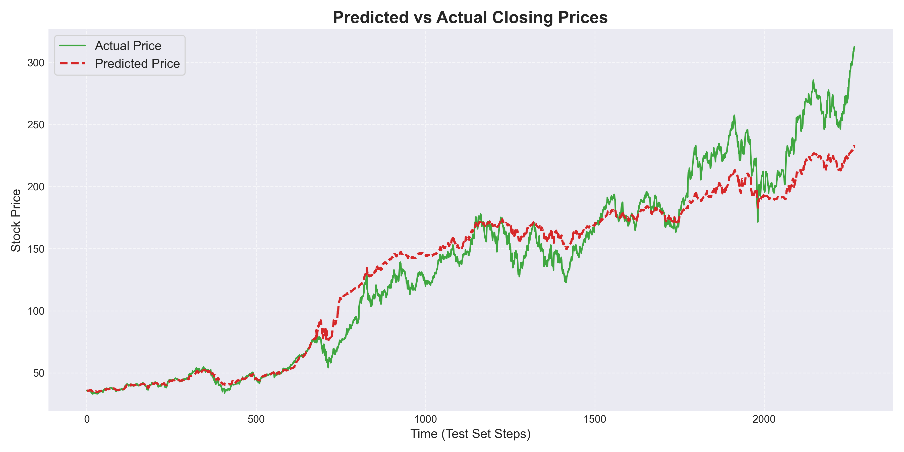
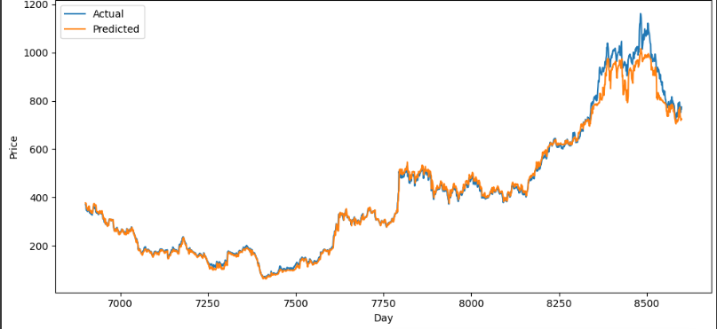
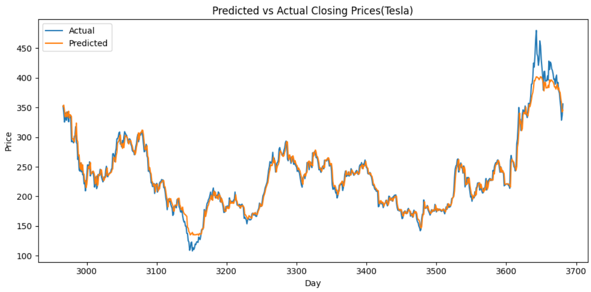
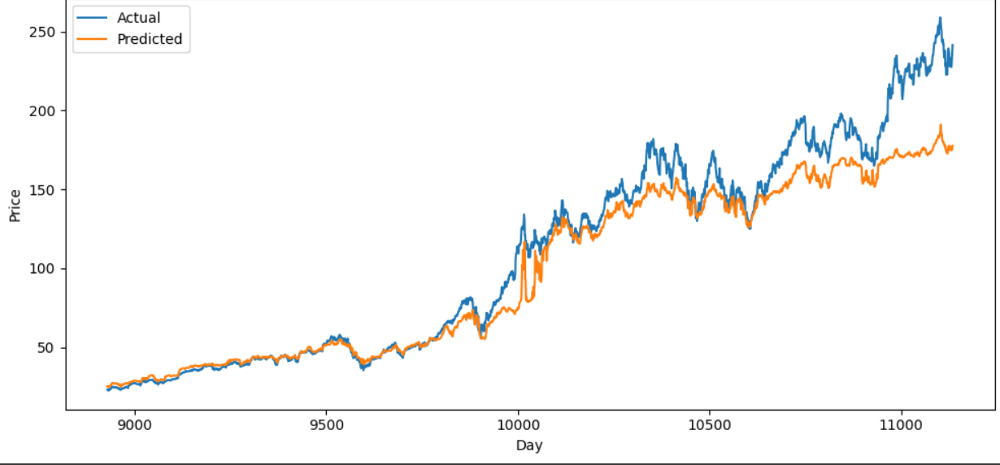

  # 📈 Stock Price Prediction Using Transformer and Time2Vec
**Author:** Abhishek Kotwani  
**Project Type:** Time Series Forecasting  
**Status:** Completed
---

## 🔍 Overview
This project implements a **Transformer-based model** for stock price prediction using historical stock data. It incorporates **Time2Vec** for time feature encoding, ensuring meaningful temporal representations. The dataset is fetched using **Yahoo Finance**, and the model is trained with **PyTorch**.  

Unlike traditional **LSTMs** or **ARIMA models**, Transformers leverage **self-attention** to capture long-term dependencies in financial time-series data. This approach enhances prediction accuracy and better captures stock price trends compared to conventional models.

---

## 🚀 Features
✅ **Fetch stock data from Yahoo Finance** automatically  
✅ **Extract technical indicators** (EMA, MACD) for trend/momentum analysis  
✅ **Implement Time2Vec** for effective time representation  
✅ **Data normalization** using MinMaxScaler and Quantile Transformer  
✅ **Transformer-based model** trained using PyTorch  
✅ **Evaluate model performance** using RMSE & MAPE  
✅ **Visualize predictions** for better interpretability

---

## 📊 Data Preparation

### **1️⃣ Data Source**
- 💾 **Yahoo Finance:** Automatically fetches stock price data for training and testing.  
- The dataset includes:
  - **Open, High, Low, Close** prices
  - **Volume**
  - **Technical indicators** (Exponential Moving Average, MACD) are not included we have calculated them manually.   

### **2️⃣ Data Preprocessing**
- Compute **Exponential Moving Averages (EMA)** for trend tracking.
- Calculate **MACD (Moving Average Convergence Divergence)** for momentum analysis.
- Generate **time-based features** for improved predictions.
- Normalize using:
  - **MinMaxScaler** (macd , ema, time2vec)
  - **Quantile Transformer** (close , open , high , low , volume)
-  choice of scaler depends on the stock, if very skewed data (common in stock price data) -log+quantile transform , if nearly normal distribution-MinMaxScaler.
### **3️⃣ How to Load Data**
- **yfinance:** Fetches stock data dynamically.
```python
if __name__ == "__main__":
    # Prepare data
    input_features, feature_scaler, time_scaler, close_scaler, scaled_close= create_input('TATAMOTORS.BO')
    # Replace 'TATAMOTORS.BO' with the desired stock name.
```
---

## **🛠 Model Implementation**
**1️⃣ Model Architecture**
  - The model is built using Transformer layers specifically adapted for time-series forecasting:
  
  - Multi-Head Self-Attention to capture dependencies between time steps.
  - Positional Encoding & Time2Vec to preserve time-step order.
  - Feed-Forward Layers for final prediction.
  - Hubber Loss to optimize training.

**2️⃣ Why Time2Vec?**
  - Time2Vec is used to encode time information effectively, improving the model's ability to capture periodic patterns in stock data.

**3️⃣ Model Training & Optimization**
  - **Batch size:** 64
  - **Optimizer:** Adam
  - **Learning rate:** 0.0001
  - **Loss function:** MSE Loss
  - **Number of epochs:** 50-100 (adjustable based on performance)


---
## 🏆 Model Evaluation
- Train-test split with 80-20% data division.
- **Metrics used for performance evaluation:**
  - Root Mean Square Error (RMSE)
  - Mean Absolute Percentage Error (MAPE)
- **Visualization:**
  - Actual vs. Predicted stock prices plotted using Matplotlib..
  - Helps assess how well the model tracks stock price trends.

---
## Tech Stack

- **Python**
- **PyTorch** (for transformer model)
- **Pandas** (data preprocessing)
- **Matplotlib** (visualization)
- **Scikit-learn** (data normalization & preprocessing)
- **Yfinance**(for stock price data)
---

## 🔧 Installation & Setup
1️⃣ Clone the Repository
```bash
git clone https://github.com/Abhi-sheKkK/Stock_Transformer.git
cd Stock_price_prediction_Vanilla_Transformer
```
2️⃣ Install Dependencies
```bash
pip install -r requirements.txt
```
3️⃣ Run the Model


---

## 📌 Usage
1.  **Select a Stock:** Change the stock name in the script.
2.  **Train the Model:** Run the training script to train on the specified stock.
3.  **Evaluate Performance**: Check RMSE and MAPE values.
4.  **Visualize Predictions:** View actual vs. predicted prices.

---
## 📈Predictions
  - **Crude_oil** (50 Epochs Full History, V2)
      - Test MSE: 3.9364  
        Test RMSE: 1.9840  
        Test MAPE: 1.79%  
        Directional Accuracy: 52.34%
        
      
    
  - **Tata_motors**
      - Test MSE: 871.0430  
        Test RMSE: 29.5134  
        Test MAPE: 3.73%
        
        
        
  - **Tesla**
      - Test MSE: 129.6440  
        Test RMSE: 11.3861  
        Test MAPE: 3.28%
        
        
  - **Apple**
      - Test MSE: 367.5187  
        Test RMSE: 19.1708  
        Test MAPE: 8.58%
        
        

 
## ✨ Recent Enhancements (v2.0)
The project has recently been refactored into a modular Python codebase with the following major upgrades:
1. **Modular Codebase & CLI**: Extracted the notebook into `src/` modules (`data.py`, `features.py`, `model.py`, `train.py`) and added a `main.py` entry point.
2. **Trainable Time2Vec**: The `Time2Vec` embedding layer has been moved natively into the `StockTransformer` with trainable `nn.Parameter` frequencies.
3. **Advanced Technical Indicators**: Built automated extraction for RSI (14-day), Bollinger Bands (20-day), ATR, and VWAP.
4. **Causal Masking**: Added an explicit `tgt_mask` to the Transformer Decoder to prevent predicting the future.
5. **MLOps**: Integrated TensorBoard for experiment tracking and introduced a new **Directional Accuracy** validation metric!

---

## 🛠 Future Enhancements

1. **Hybrid Model Integration**

   - Combine the Transformer with other models (e.g., LSTMs, CNNs, or traditional regression- 
    based models) to leverage their strengths and improve prediction accuracy.

2. **Sudden Price Surge Prediction**

   - Enhance the model to better predict sudden spikes in stock prices, which are currently 
     underestimated.
     
---
## Key Challenges and Solutions

### 1. Data Scaling and Preprocessing
#### Challenges:
- Traditional min-max scaling failed to adapt to changing market regimes.
- Extreme price movements led to scaling instability.
- Different features (price, volume, indicators) required different scaling approaches.

#### Solutions:
- Implemented adaptive scaling with sliding windows.
- Applied log transformation before scaling for price data.
- Quantile transformer on the log transformations.
- Developed feature-specific scaling strategies.


---

### 2. Loss Function Design
#### Challenges:
- Standard MSE loss led to conservative predictions.
- Difficulty in balancing short-term vs long-term accuracy.
- Inadequate handling of directional movements.
- Poor performance during market regime changes.

#### Solutions:
- Huber loss for robustness.


---


### 3. Time2Vec Optimization
#### Challenges:
- Finding the best frequencies and phase shifts for Time2Vec embedding manually is difficult and suboptimal.

#### Solutions:
- Converted the Time2Vec frequencies and phase shifts to PyTorch `nn.Parameter` tensors, allowing the model to intrinsically learn the optimal time frequencies via backpropagation during training.

---


## 🐝 License
This project is licensed under the MIT License.

---

## 🤝 Contributing
Feel free to submit issues or pull requests for improvements!

---

## 💎 Contact
For any queries, feel free to reach out at:
- 📧 Email: abhishek.9.kotwani@gmail.com
- 🔗 GitHub: [Abhi-sheKkK](https://github.com/Abhi-sheKkK)


