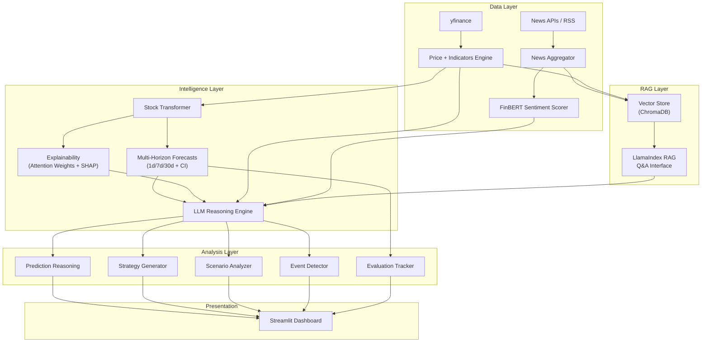

# AI Financial Intelligence System — Full Implementation Plan

## Current State → Target State

**Now**: Stock price prediction tool (Transformer + Time2Vec, Streamlit UI, CLI)
**Goal**: Full-stack AI Financial Intelligence System with reasoning, news, strategies, and explainability

---

## Feature Feasibility Assessment

### ✅ Tier 1 — Core (All Feasible, Build First)

| Feature | Status | Notes |
|---|---|---|
| Market Data & Visualization | 🟢 **Mostly exists** | OHLCV + indicators already in [features.py](file:///Users/shubham/github_work/Stock_Transformer/src/features.py). Add multi-timeframe views |
| Forecasting Engine | 🟡 **Extend** | Model exists for 5-day. Need multi-horizon (1d/7d/30d) + confidence intervals via MC Dropout |
| News + Data Ingestion | 🔵 **New** | `yfinance` has built-in news. Add RSS/finnhub for depth. Straightforward |
| RAG Question Answering | 🔵 **New, High effort** | Needs vector store + embeddings + LLM chain. LlamaIndex is the right pick here — lighter than LangChain for this use case |
| Simple Interface | 🟢 **Exists** | Streamlit already in place, just needs more tabs |

### ✅ Tier 2 — Differentiators (All High-Value, Build Second)

| Feature | Feasibility | My Take |
|---|---|---|
| **Explainable Forecasting** | 🟢 High | **This is your #1 killer feature.** Extract attention weights from the Transformer + SHAP values. Link predictions → news/events. Very doable since we control the model architecture |
| Multi-Modal Reasoning | 🟢 High | Natural extension of the AI engine — combine price + news + indicators → unified answer |
| Event Detection | 🟢 High | Statistical anomaly detection on price/volume (z-score based) + temporal linking to news. Clean and impressive |
| Sentiment Analysis | 🟢 High | FinBERT (HuggingFace, free, runs locally) for news sentiment. Track sentiment trend vs price — great visualization |
| Portfolio Simulation | 🟡 Medium | Backtesting logic is non-trivial but very recruiter-friendly. Can start simple (buy/hold/sell based on signals) |
| Alerts System | 🟢 High | In-app alerts (RSI overbought, MACD crossover, news triggers). No external notification infra needed for V1 |

### ⚠️ Tier 3 — Advanced (Selective — Pick the Highest Impact)

| Feature | Feasibility | My Take |
|---|---|---|
| Multi-Stock Correlation | 🟢 High | Correlation matrix + sector grouping. Standard quant work |
| **Scenario Analysis** | 🟢 High | **Extremely impressive.** "What if interest rates rise?" → LLM retrieves context + generates impact reasoning. This is a differentiator |
| Risk Analysis | 🟢 High | VaR, drawdown, Sharpe ratio — standard metrics, easy to add |
| Hybrid Prediction | 🟡 Medium | Combining Transformer + sentiment + events into a unified prediction. Needs careful architecture but very strong |
| **Evaluation System** | 🟢 High | **I strongly agree this is rare and critical.** Track prediction accuracy, RAG quality, explanation relevance. Most projects skip this — having it makes you stand out |

### 🔮 Tier 4 — Elite (Long-term, Build Last)

| Feature | Feasibility | My Take |
|---|---|---|
| Agent-Based System | 🟡 Medium | LangGraph agent that decides what to retrieve/forecast/explain autonomously. Impressive but complex to get right |
| Research Mode | 🟢 High | "Analyze Tesla fully" → generates a full report. Mostly LLM orchestration with structured prompts |
| Personalized Intelligence | 🔴 Low (for now) | Needs user accounts + state persistence. Skip for V1, note as roadmap |
| Comparative Analysis | 🟢 High | "Compare Tesla vs Apple" — run the pipeline twice and present side-by-side. Actually quite doable |
| Continuous Learning | 🟡 Medium | Model retraining with new data. Good MLOps showcase but needs careful implementation |

---

## Honest Recommendations

> [!IMPORTANT]
> **Don't build everything at once.** A polished system with 15 features beats a half-finished system with 30. Here's what I'd prioritize:

### Must-Have for V1 (Makes the project impressive)
1. **Explainable Forecasting** — attention heatmaps, feature importance, prediction → news linking
2. **RAG Q&A** — "Why did AAPL drop?" with source-cited answers
3. **Multi-Horizon Forecasting** with confidence intervals
4. **News + Sentiment** pipeline with FinBERT
5. **Evaluation Dashboard** — accuracy tracking + RAG quality metrics

### Strong Adds for V2
6. Scenario Analysis, Event Detection, Portfolio Simulation
7. Alerts System, Risk Analysis
8. Research Mode, Comparative Analysis

### Skip for Now
- Personalized Intelligence (needs user auth infrastructure)
- Continuous Learning (MLOps complexity, better as a documented roadmap item)
- Full Agent-Based System (good capstone, but get the pieces working first)

---

## Revised Architecture



---

## Phased Implementation Roadmap

### Phase 1 — Foundation (Config + Data Pipeline)
| File | Type | What |
|---|---|---|
| [config.py](file:///Users/shubham/github_work/Stock_Transformer/src/config.py) | NEW | Centralized config, `.env` support, feature flags |
| [.env.example](file:///Users/shubham/github_work/Stock_Transformer/.env.example) | NEW | API keys template |
| [news.py](file:///Users/shubham/github_work/Stock_Transformer/src/news.py) | NEW | News fetching + caching (yfinance + RSS + optional API) |
| [sentiment.py](file:///Users/shubham/github_work/Stock_Transformer/src/sentiment.py) | NEW | FinBERT sentiment scoring, trend tracking |
| [features.py](file:///Users/shubham/github_work/Stock_Transformer/src/features.py) | MODIFY | Add `get_market_snapshot()` for human-readable indicator summary |

### Phase 2 — Intelligence (Forecasting + Explainability)
| File | Type | What |
|---|---|---|
| [model.py](file:///Users/shubham/github_work/Stock_Transformer/src/model.py) | MODIFY | Multi-horizon output heads (1d/7d/30d), MC Dropout for confidence intervals, attention weight extraction |
| [ai_engine.py](file:///Users/shubham/github_work/Stock_Transformer/src/ai_engine.py) | NEW | LLM client (provider-agnostic), prediction reasoning, strategy generation, scenario analysis |
| [prompts.py](file:///Users/shubham/github_work/Stock_Transformer/src/prompts.py) | NEW | Structured prompt templates with JSON output schemas |
| [explainability.py](file:///Users/shubham/github_work/Stock_Transformer/src/explainability.py) | NEW | Attention heatmaps, feature importance, prediction-to-event linking |
| [events.py](file:///Users/shubham/github_work/Stock_Transformer/src/events.py) | NEW | Anomaly detection on price/volume, temporal event linking |

### Phase 3 — RAG + Evaluation
| File | Type | What |
|---|---|---|
| [rag.py](file:///Users/shubham/github_work/Stock_Transformer/src/rag.py) | NEW | LlamaIndex-based RAG: ingest news + filings → ChromaDB → Q&A with source citations |
| [evaluation.py](file:///Users/shubham/github_work/Stock_Transformer/src/evaluation.py) | NEW | Prediction accuracy tracking, RAG quality metrics, explanation relevance scoring |

### Phase 4 — Dashboard + CLI
| File | Type | What |
|---|---|---|
| [app.py](file:///Users/shubham/github_work/Stock_Transformer/app.py) | MODIFY | Full rewrite: 6+ tabs (Overview, Predictions, Explainability, News, Strategy, Evaluation, Training) |
| [predict.py](file:///Users/shubham/github_work/Stock_Transformer/predict.py) | MODIFY | Rich CLI with `--analyze`, `--news`, `--scenario` flags |
| [requirements.txt](file:///Users/shubham/github_work/Stock_Transformer/requirements.txt) | MODIFY | Add all new dependencies |
| [README.md](file:///Users/shubham/github_work/Stock_Transformer/README.md) | MODIFY | Full documentation rewrite |

### Phase 5 — Advanced Features
| File | Type | What |
|---|---|---|
| [portfolio.py](file:///Users/shubham/github_work/Stock_Transformer/src/portfolio.py) | NEW | Backtesting engine, portfolio simulation |
| [correlation.py](file:///Users/shubham/github_work/Stock_Transformer/src/correlation.py) | NEW | Multi-stock correlation, sector analysis |
| [risk.py](file:///Users/shubham/github_work/Stock_Transformer/src/risk.py) | NEW | VaR, drawdown, Sharpe ratio, risk-adjusted metrics |
| [research.py](file:///Users/shubham/github_work/Stock_Transformer/src/research.py) | NEW | Full company analysis report generation |

---

## New Dependencies

```
# LLM & RAG
openai>=1.0.0
llama-index>=0.10.0
chromadb>=0.4.0

# Sentiment
transformers>=4.35.0
torch  # already present

# News
feedparser>=6.0.0
requests>=2.31.0

# Config
python-dotenv>=1.0.0

# CLI
rich>=13.0.0

# Evaluation
scipy>=1.11.0
```

---

## Verification Plan

### Per-Phase Smoke Tests
```bash
# Phase 1
python -c "from src.news import fetch_news; print(fetch_news('AAPL')[:2])"
python -c "from src.sentiment import score_headlines; print(score_headlines(['Apple beats earnings']))"

# Phase 2
python -c "from src.explainability import get_attention_map; print('OK')"
python -c "from src.ai_engine import generate_prediction_reasoning; print('Engine loaded')"

# Phase 3
python -c "from src.rag import ask_question; print(ask_question('Why did AAPL drop?'))"

# Phase 4
streamlit run app.py  # Visual verification of all tabs
python predict.py --ticker AAPL --analyze
```

### Evaluation Metrics to Track
- Prediction accuracy: MAE, RMSE, directional accuracy (already have this)
- RAG quality: retrieval precision, answer relevance
- Sentiment correlation: sentiment score vs next-day price movement

> [!IMPORTANT]
> **Required from you before building**: Which LLM provider + API key will you use? (OpenAI / Gemini / Ollama). This determines the `ai_engine.py` implementation.
